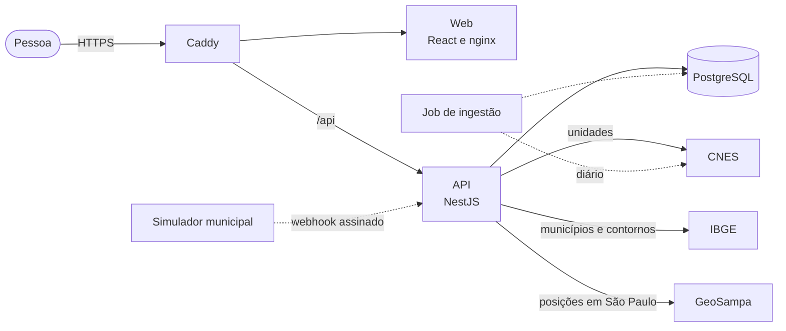
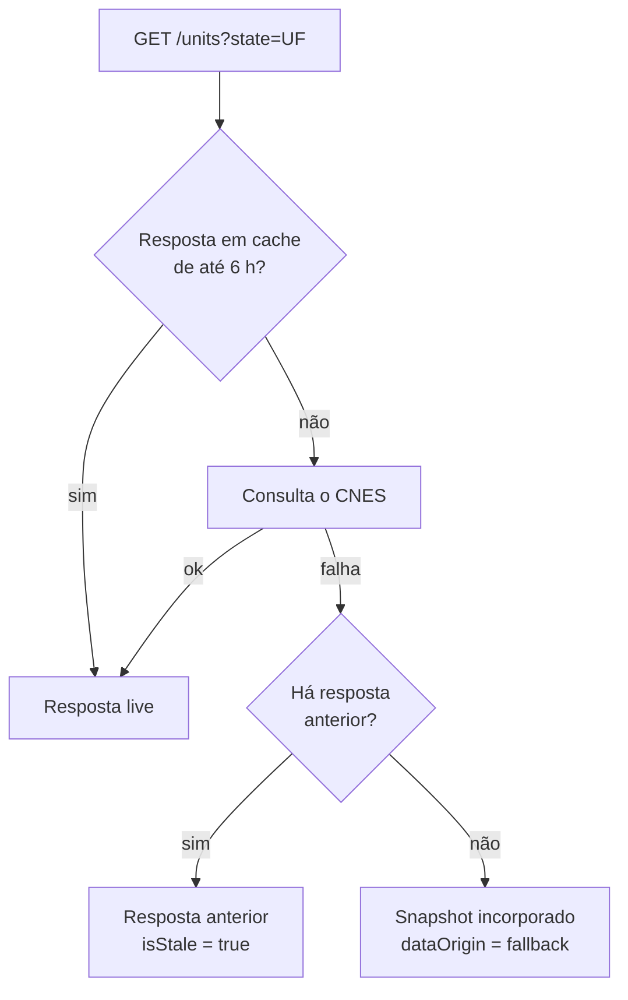
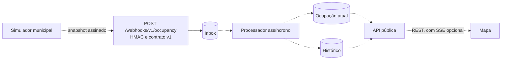

# FilaSaúde

Informação pública sobre unidades de pronto atendimento do SUS, em um mapa e em
uma lista acessíveis.

[](https://www.typescriptlang.org/)
[](https://react.dev/)
[](https://nestjs.com/)
[](https://www.postgresql.org/)
[](https://playwright.dev/)

O FilaSaúde é um Projeto Integrador da UNIVESP. Ele reúne, em um só lugar, os
dados públicos das unidades que fazem pronto atendimento pelo SUS (endereço,
localização, tipo, horário informado) e mostra de onde cada dado veio e de
quando é.

> **Pergunta do projeto:** como facilitar a consulta de informações sobre
> unidades públicas de pronto atendimento disponíveis em determinada região?

O mapa é a porta de entrada. A lista deve trazer as mesmas informações do mapa
e é o caminho para quem navega por teclado ou leitor de tela.

## O que o FilaSaúde não faz

O FilaSaúde não é uma plataforma de orientação médica. Ele não faz diagnóstico,
triagem nem avaliação de sintomas, não recomenda qual estabelecimento procurar,
não estima tempo de espera e não substitui os canais oficiais de saúde e de
emergência. A ordem dos resultados é alfabética e não indica prioridade. Esses
limites orientam o produto e cada decisão de arquitetura abaixo.

## Estado do projeto

| Frente | Estado | Referência |
| --- | --- | --- |
| Cadastro nacional de unidades (CNES e IBGE) | Implementado | [ADR 0001](docs/adr/0001-public-health-unit-data-source.md) |
| Validação e correção da posição das unidades | Implementado | [ADR 0001](docs/adr/0001-public-health-unit-data-source.md) |
| Posição adicional do GeoSampa (município de São Paulo) | Implementado | [ADR 0002](docs/adr/0002-additional-public-data-sources.md) |
| Mapa, lista, busca e acessibilidade | Implementado | [`.interface-design/system.md`](.interface-design/system.md) |
| Correção manual de posição por administradores | Implementado | [guia de deploy](docs/deployment.md#correções-manuais-de-posição) |
| Recebimento de snapshots de ocupação (webhook assinado) | Implementado: recebe e guarda | [contrato v1](docs/contracts/occupancy-snapshot-v1.md) |
| Ingestão diária do CNES no PostgreSQL | Planejado | [#23](https://github.com/PJIEixoComputacaoUnivesp/FilaSaude/issues/23) |
| Processamento, estado atual e histórico de ocupação | Planejado | [#78](https://github.com/PJIEixoComputacaoUnivesp/FilaSaude/issues/78) |
| Simulador municipal de ocupação | Planejado | [#57](https://github.com/PJIEixoComputacaoUnivesp/FilaSaude/issues/57) |
| Camada de ocupação simulada no mapa | Planejado | [#79](https://github.com/PJIEixoComputacaoUnivesp/FilaSaude/issues/79) |
| Busca por proximidade e filtros por característica | Planejado | [#28](https://github.com/PJIEixoComputacaoUnivesp/FilaSaude/issues/28), [#29](https://github.com/PJIEixoComputacaoUnivesp/FilaSaude/issues/29) |

A parte de ocupação segue a [proposta 0001](docs/proposals/0001-operational-occupancy-simulation.md),
que ainda está em discussão no grupo. Nela, os dados operacionais são
sintéticos e sempre identificados como simulação acadêmica, porque não existe
uma fonte pública nacional de ocupação em tempo próximo do real.

## Arquitetura



Linhas contínuas existem hoje. Linhas tracejadas são o alvo.

### Componentes

| Componente | Responsabilidade | Tecnologia | Código |
| --- | --- | --- | --- |
| Web | Interface pública (mapa, lista, "Sobre os dados") e a página `/admin`, fora da navegação | React 19, Vite, Tailwind 4, React Router, Leaflet | [`apps/web`](apps/web) |
| API | Integra e normaliza as fontes públicas, valida a posição das unidades, recebe webhooks e expõe REST | NestJS 12, TypeORM | [`apps/api`](apps/api) |
| PostgreSQL | Correções manuais, inbox de webhooks e, quando houver ingestão, o cadastro de unidades | PostgreSQL 17 | [`apps/api/src/database`](apps/api/src/database) |
| Borda | HTTPS e roteamento de `/api` em produção | Caddy | [`deploy`](deploy) |
| Infraestrutura | Droplet, IP reservado, firewall e DNS | Terraform, DigitalOcean | [`infra/terraform`](infra/terraform) |

### Princípios

1. **Procedência em cada dado.** Toda unidade informa `sources`, com a fonte de
   cada campo e a data de atualização. Dado ausente fica nulo; nada é inferido
   em silêncio. A interface mostra fonte e data junto da informação.
2. **Posição nunca é corrigida às escondidas.** `location.precision` diz de
   onde vem o ponto (`manual`, `source`, `history` ou `municipality`) e
   `location.original` guarda a coordenada informada pelo CNES. A interface
   avisa quando o ponto não é o do cadastro.
3. **A fonte externa não fica no caminho da pessoa.** O alvo é um job separado
   da API HTTP, que ingere o CNES por UF e atualiza o PostgreSQL de forma
   idempotente pelo código CNES. Até lá, a API consulta o CNES durante a
   requisição, com cache de seis horas e cópia de segurança.
4. **Degradação previsível.** Se o CNES falhar, a API responde com a última
   resposta válida marcada como desatualizada ou, na falta dela, com o snapshot
   incorporado. `metadata.dataOrigin` e `metadata.isStale` dizem qual caso é.
5. **Dado cadastral e dado operacional são separados.** O cadastro vem de
   fontes públicas reais. A ocupação, quando existir, vem de outro fluxo, é
   sintética e vem identificada como tal em tela, em resposta de API e em
   demonstração.
6. **PostgreSQL basta.** Ele guarda cadastro, correções, inbox e histórico. Um
   broker de mensagens só entra se os requisitos mudarem.
7. **O mapa não é o único caminho.** Os marcadores não são acessíveis por
   teclado, então a lista precisa ter tudo o que o mapa mostra.
8. **Sem contas de usuário e sem dados pessoais.** A parte pública é anônima.
   A administração usa tokens pessoais em um secret, sem rota que crie ou
   altere administradores.

### Como uma unidade chega à tela

A consulta por UF passa pelo cache e pela cópia de segurança. A consulta
nacional (`ALL` ou `BR`) é sempre atendida pelo snapshot, sem consultar o CNES.



Todas as respostas passam pela mesma verificação de posição. A coordenada do
CNES é autodeclarada e parte dela cai fora do município, então a API compara o
ponto com o contorno do IBGE (tolerância de 5 km) e escolhe, nesta ordem:

1. posição definida por um administrador (`manual`);
2. coordenada atual do CNES, quando está dentro do município (`source`);
3. último ponto do histórico mensal do CNES para o mesmo endereço (`history`);
4. centro do município (`municipality`).

Nenhuma unidade é removida por causa da posição. No município de São Paulo, a
API ainda tenta cruzar a unidade com a camada de urgência do GeoSampa, e só
aceita uma correspondência única e forte. Os critérios e as limitações estão no
[ADR 0001](docs/adr/0001-public-health-unit-data-source.md) e no
[ADR 0002](docs/adr/0002-additional-public-data-sources.md).

### Ocupação operacional (proposta em discussão)



Hoje a API autentica a fonte, valida o contrato v1 e persiste o snapshot na
inbox antes de responder `202 Accepted`. O processamento, o estado atual e o
histórico ainda não existem. A atualização em tempo real por SSE é opcional na
[#78](https://github.com/PJIEixoComputacaoUnivesp/FilaSaude/issues/78); sem
ela, a interface consulta por polling.

### API

| Endpoint | Descrição | Estado |
| --- | --- | --- |
| `GET /health` | Estado da API | Implementado |
| `GET /units?state=UF` | Unidades de uma UF; sem `state` ou com `ALL`/`BR`, todo o Brasil | Implementado |
| `POST /webhooks/v1/occupancy` | Recebe um snapshot de ocupação assinado | Implementado |
| `GET /admin/me` e `/admin/location-corrections` | Administração de posições, com `Authorization: Bearer` | Implementado |
| `GET /units` com ocupação | Estado de ocupação, em campos opcionais que não quebram o contrato atual | Planejado (#78) |
| `GET /units/{cnes}/occupancy-history` | Histórico recente de ocupação (a proposta parte das últimas 24 horas) | Planejado (#78) |
| `GET /occupancy/stream` | Notificações de atualização por SSE | Opcional (#78) |

Os detalhes das rotas, dos campos e dos cabeçalhos estão em
[`apps/api/README.md`](apps/api/README.md) e no
[contrato do snapshot](docs/contracts/occupancy-snapshot-v1.md). Os caminhos e
parâmetros da API são em inglês, e o texto exibido ao usuário é em português do
Brasil.

### Dados persistidos

| Tabela | Conteúdo | Estado |
| --- | --- | --- |
| `unit_location_corrections` | Posição definida por administradores, por código CNES | Implementado |
| `unit_location_correction_events` | Histórico de cada alteração e quem a fez | Implementado |
| `occupancy_webhook_inbox` | Snapshots recebidos, antes do processamento | Implementado |
| `health_units` | Cadastro de unidades | Criada, ainda sem ingestão |
| Ocupação atual e histórico | Estado e série por unidade | Planejado |

As migrations são executadas de forma explícita e o `synchronize` do TypeORM
fica desligado.

## Estrutura do repositório

```text
.
├── apps/
│   ├── web/                # React: mapa, lista, Sobre os dados e /admin
│   └── api/                # NestJS: units, admin, webhooks e database
├── e2e/                    # Playwright (fluxo da interface com API simulada)
├── docs/
│   ├── adr/                # Decisões de arquitetura aceitas
│   ├── proposals/          # Propostas em discussão
│   ├── contracts/          # Contratos de integração (snapshot de ocupação v1)
│   ├── research/           # Resumo do levantamento de pesquisa
│   └── deployment.md       # Provisionamento, publicação e rollback
├── deploy/                 # Compose de produção, Caddyfile, deploy e backup
├── infra/terraform/        # Droplet, IP reservado, firewall e DNS
├── .github/workflows/      # CI, deploy sob demanda e notificação de PRs
├── .interface-design/      # Sistema de interface e decisões de UX
├── .agents/                # Skills e agentes do projeto
├── compose.yaml            # Desenvolvimento local: API, web e PostgreSQL
└── AGENTS.md               # Convenções para pessoas e agentes
```

## Executando localmente

Requisitos: Node.js 24.15 ou superior na série 24 (`.nvmrc`), pnpm 11 e Docker
ou Podman para o PostgreSQL.

```bash
pnpm install
docker compose up -d postgres
pnpm --filter @filasaude/api migration:run
pnpm dev
```

O frontend fica em `http://localhost:5173` e a API em `http://localhost:3000`
(`/health`). O frontend repassa `/api` para a API. A API conecta ao PostgreSQL
ao iniciar, então ele precisa estar no ar.

Para subir tudo em contêineres, com o frontend em `http://localhost:8080` e a
API acessível também por `http://localhost:8080/api`:

```bash
docker compose up --build
```

As variáveis de ambiente estão documentadas em [`.env.example`](.env.example).
A API não carrega arquivos `.env`; o Compose injeta as variáveis do banco, e
fora dele elas precisam estar exportadas no shell. `ADMIN_API_TOKENS` liga a
administração de posições e `WEBHOOK_SOURCE_CONFIG` define as fontes que podem
enviar ocupação. Nunca versione valores reais.

## Qualidade

| Comando | O que faz |
| --- | --- |
| `pnpm lint` | Oxlint em todo o monorepo e nos testes e2e |
| `pnpm typecheck` | TypeScript estrito |
| `pnpm test` | Vitest (API e web) |
| `pnpm --filter @filasaude/api test:e2e` | Testes e2e da API |
| `pnpm playwright test` | Fluxo da interface, com a API simulada |
| `pnpm build` | Build de todos os pacotes |
| `pnpm check` | Lint, typecheck, testes e build em sequência |

O `pre-commit` roda o Oxlint nos arquivos TypeScript em staging e o `pre-push`
roda `pnpm check`. A CI repete essas verificações, roda o Playwright e valida o
Terraform. Os hooks ajudam, mas não substituem a CI.

As convenções de código, idioma, commits e revisão estão em
[`AGENTS.md`](AGENTS.md). Em resumo: nomes de código em inglês, texto da
interface em português do Brasil com acentuação correta, commits pequenos em
português com prefixo convencional e testes junto de cada mudança de
comportamento.

## Produção

O Terraform provisiona um Droplet na DigitalOcean com IP reservado, firewall e
DNS opcional. No servidor, o Docker Compose executa Caddy, web, API e
PostgreSQL. O Caddy termina o HTTPS e encaminha `/api` para a API e o resto para
o frontend.

As imagens são construídas e publicadas no GitHub Container Registry apenas
quando se faz um deploy. O deploy é sob demanda, pelo workflow `Deploy`, e só
quem está na lista `DEPLOYERS` pode executá-lo, a partir da `main`. O rollback é
um novo deploy com uma tag `sha-<commit>` anterior. O guia
[`docs/deployment.md`](docs/deployment.md) traz provisionamento, secrets,
backups e o passo a passo.

## Documentação

- [ADR 0001](docs/adr/0001-public-health-unit-data-source.md): fonte pública de unidades, posição e correção manual.
- [ADR 0002](docs/adr/0002-additional-public-data-sources.md): fontes públicas adicionais.
- [Proposta 0001](docs/proposals/0001-operational-occupancy-simulation.md): simulação de ocupação operacional.
- [Contrato do snapshot de ocupação v1](docs/contracts/occupancy-snapshot-v1.md) e seu [JSON Schema](docs/contracts/occupancy-snapshot-v1.schema.json).
- [Visão geral da pesquisa](docs/research/README.md).
- [Sistema de interface](.interface-design/system.md): jornada, acessibilidade e mobile.
- [Guia de deploy](docs/deployment.md) e [infraestrutura](infra/terraform/README.md).
- [README da API](apps/api/README.md).

## Licença

[MIT](LICENSE).
