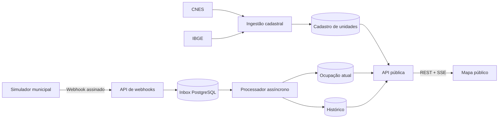

# Proposta 0001: Simulação de ocupação operacional

- **Status:** em discussão
- **Data:** 2026-09-25
- **Público da revisão:** equipe do projeto FilaSaúde e orientação acadêmica
- **Decisão esperada:** refinar, aprovar, substituir ou remover as propostas deste documento
- **Referências relacionadas:** [ADR 0001](../adr/0001-public-health-unit-data-source.md),
  [issue #22](https://github.com/PJIEixoComputacaoUnivesp/FilaSaude/issues/22),
  [PR #44](https://github.com/PJIEixoComputacaoUnivesp/FilaSaude/pull/44) e
  [issue #45](https://github.com/PJIEixoComputacaoUnivesp/FilaSaude/issues/45)

> Este documento não registra uma decisão arquitetural aprovada. Ele consolida
> uma proposta inicial para que o grupo possa discutir objetivos, limites,
> alternativas e responsabilidades antes da implementação.

## 1. Contexto acadêmico

O projeto deve demonstrar o desenvolvimento de um software com framework web,
banco de dados, JavaScript, infraestrutura em nuvem, consumo ou fornecimento de
API, acessibilidade, controle de versão e testes. A análise de dados é opcional.

O tema escolhido pelo grupo é uma aplicação informativa sobre unidades públicas
de pronto atendimento. O cadastro das unidades pode vir de fontes públicas como
CNES e IBGE, mas não há uma fonte pública nacional e unificada que informe, em
tempo próximo do real, a ocupação operacional de todas essas unidades.

A proposta é demonstrar como uma plataforma de integração poderia receber
atualizações dos sistemas locais das unidades ou de uma administração municipal,
armazená-las e refletir a situação no mapa. Como não existe integração com uma
instituição real neste momento, os dados operacionais seriam **sintéticos e
explicitamente identificados como simulação acadêmica**.

## 2. Objetivo e limites do produto

### Objetivo proposto

Permitir que uma pessoa consulte unidades públicas de urgência em um mapa e,
quando a camada de demonstração estiver habilitada, visualize a ocupação
operacional simulada de uma amostra de unidades.

O nome FilaSaúde pode ser mantido, mas a descrição do produto deve deixar claro
o recorte adotado, por exemplo: “informações sobre unidades de urgência e
demonstração acadêmica de ocupação operacional”.

### Fora do escopo

O FilaSaúde não deve:

- diagnosticar, triar ou orientar clinicamente uma pessoa;
- recomendar qual estabelecimento procurar;
- classificar unidades como melhores ou piores;
- estimar tempo de espera ou gravidade de atendimento;
- informar posição individual em fila;
- receber dados pessoais, clínicos ou prontuários de pacientes;
- apresentar os dados simulados como informações operacionais reais.

Esses limites reduzem riscos de interpretação indevida e mantêm o sistema como
uma plataforma informativa e uma prova de conceito de integração.

## 3. Origem e natureza dos dados

O sistema trabalharia com dois grupos de dados independentes.

### Dados cadastrais reais

Nome, código CNES, tipo, endereço, município, coordenadas e atualização cadastral
seriam obtidos do CNES e do IBGE conforme o
[ADR 0001](../adr/0001-public-health-unit-data-source.md). A interface deve
informar a fonte e a data de atualização.

As coordenadas originais não devem ser corrigidas silenciosamente. Se o projeto
vier a manter uma localização revisada para exibição, ela deve ser armazenada
separadamente, com origem, precisão e histórico de alteração, conforme a
[issue #45](https://github.com/PJIEixoComputacaoUnivesp/FilaSaude/issues/45).

### Dados operacionais sintéticos

Capacidade e ocupação seriam produzidas por um simulador controlado pelo grupo.
Toda tela, resposta de API e demonstração que use esses dados deve identificá-los
como “dados simulados” ou “simulação acadêmica”.

A proposta inicial é selecionar entre 10 e 20 unidades de um mesmo município,
identificadas pelo código CNES e com coordenadas cadastrais válidas. O município
e as unidades são configuráveis. Na ausência de outra escolha ou parceria,
São Paulo pode servir como conjunto de demonstração inicial.

## 4. Experiência pública proposta

O mapa mantém marcadores neutros por padrão. Uma camada opcional chamada
“Ocupação simulada”, inicialmente desligada, aplica faixas visuais às unidades
participantes. A cor nunca deve ser a única forma de transmitir a informação:
percentual, faixa textual, data da observação e situação da confirmação também
devem estar disponíveis para tecnologias assistivas.

Como ponto de partida para discussão, a ocupação geral seria calculada pela soma
da ocupação dividida pela soma da capacidade das categorias informadas:

- **baixa:** abaixo de 60%;
- **moderada:** entre 60% e 84%;
- **alta:** a partir de 85%.

Uma categoria ausente significa “não informada” ou “não aplicável”, nunca zero.
As categorias iniciais sugeridas são:

- observação;
- estabilização;
- internação.

Ao selecionar uma unidade, a pessoa poderia consultar o estado atual e um
histórico acessível das últimas 24 horas, tanto em gráfico quanto em forma
textual. Um botão “Abrir rota no Google Maps” poderia usar uma URL universal do
Google Maps, sem chave de API e sem armazenar a localização da pessoa. A rota só
deve ser oferecida quando a localização exibida estiver validada.

Nenhum desses dados deve gerar ordenação, recomendação ou indicação de qual
unidade procurar.

## 5. Arquitetura candidata



O simulador representa a ponta que, em um cenário real, pertenceria ao sistema
municipal ou à unidade de saúde. Ele permite alterar ocupações manualmente,
executar cenários determinísticos e demonstrar falhas como duplicidade, atraso
e interrupção temporária das confirmações.

A API do FilaSaúde representa a plataforma central. Ela autentica a origem,
persiste o evento antes de responder, processa as atualizações de forma
assíncrona e publica o novo estado para o frontend.

O PostgreSQL funciona como cadastro, histórico e fila transacional inicial. Um
broker como RabbitMQ ou Kafka aumentaria a complexidade sem trazer benefício
necessário para a escala acadêmica proposta, mas pode ser reavaliado caso os
requisitos mudem.

## 6. Como o webhook funcionaria

Webhook é uma requisição HTTP enviada pelo sistema de origem quando ocorre uma
mudança ou quando ele precisa confirmar seu estado. Nesse modelo:

1. o sistema municipal registra localmente uma alteração operacional;
2. ele cria um snapshot completo da ocupação da unidade;
3. assina o corpo da requisição e o envia ao FilaSaúde;
4. o FilaSaúde autentica e valida o evento;
5. o evento é persistido em uma inbox;
6. a API responde `202 Accepted` sem aguardar todo o processamento;
7. um processador atualiza o histórico e, quando aplicável, o estado atual;
8. o frontend recebe uma notificação SSE e busca ou aplica o novo estado.

### Responsabilidades da origem

- identificar cada evento de forma única;
- enviar snapshots completos, não apenas incrementos ou decrementos;
- informar quando a mudança aconteceu e quando foi observada;
- assinar a requisição com o segredo correspondente à fonte;
- repetir falhas transitórias com espera progressiva e o mesmo identificador;
- confirmar periodicamente o estado, mesmo quando não houver mudança.

### Responsabilidades do FilaSaúde

- autenticar a origem e validar o contrato na borda da API;
- garantir que a fonte está autorizada a atualizar aquela unidade CNES;
- persistir antes de confirmar o recebimento;
- ignorar efeitos duplicados sem perder a rastreabilidade;
- manter eventos atrasados no histórico sem substituir um estado mais recente;
- distinguir dado inválido de falha transitória;
- sinalizar quando não houver confirmação recente.

## 7. Contrato candidato

O formato abaixo é apenas uma referência inicial para discussão e prototipação:

```json
{
  "eventId": "01K5T2S6C4TZ1K9TR6F89A2M7X",
  "type": "occupancy.snapshot.v1",
  "unitCnes": "1234567",
  "occurredAt": "2026-09-25T14:30:00-03:00",
  "observedAt": "2026-09-25T14:30:05-03:00",
  "categories": [
    {
      "code": "observation",
      "capacity": 20,
      "occupied": 13
    },
    {
      "code": "stabilization",
      "capacity": 4,
      "occupied": 2
    }
  ]
}
```

Campos de tempo teriam significados diferentes:

- `occurredAt`: quando o estado mudou no sistema local;
- `observedAt`: quando a origem confirmou esse estado;
- `receivedAt`: quando o FilaSaúde recebeu o evento, preenchido pelo servidor.

A autenticação candidata usa cabeçalhos com identificador da fonte, instante de
envio e assinatura. A assinatura seria calculada com HMAC-SHA256 sobre a
concatenação do instante, um ponto e o corpo HTTP original:

```text
signature = HMAC_SHA256(sourceSecret, timestamp + "." + rawBody)
```

Segredos devem existir somente em variáveis de ambiente ou em um gerenciador de
segredos. Para a prova de conceito, cada fonte teria um segredo independente e
uma associação explícita com as unidades que pode atualizar.

### Idempotência, ordem e retentativas

- o mesmo `eventId` não pode produzir efeitos duas vezes;
- uma retentativa mantém o `eventId`, mas recebe novo instante e nova assinatura
  de transporte;
- timeouts e respostas `5xx` podem ser repetidos com espera progressiva;
- erros de contrato ou autenticação (`4xx`) não entram em repetição infinita;
- um snapshot atrasado é preservado no histórico, mas não sobrescreve o estado
  atual quando já existe outro mais recente.

### Confirmação periódica

Ausência de novos atendimentos não significa que a informação esteja
desatualizada. Por isso, a origem enviaria um snapshot completo a cada cinco
minutos mesmo sem mudanças. Após vinte minutos sem confirmação, a interface
ocultaria a faixa de ocupação e mostraria “sem confirmação recente”. Esses
intervalos são parâmetros propostos, não decisões definitivas.

## 8. Interfaces públicas candidatas

As rotas seguem nomenclatura REST em inglês:

- `POST /webhooks/v1/occupancy`: recebe snapshots autenticados;
- `GET /units`: mantém os dados cadastrais e pode incluir estado de ocupação de
  forma aditiva;
- `GET /units/{cnes}/occupancy-history`: consulta o histórico recente;
- `GET /occupancy/stream`: envia notificações SSE de atualização.

O frontend usaria REST para o carregamento inicial e SSE para atualizações. Em
uma reconexão, um identificador monotônico de stream permitiria recuperar os
eventos possíveis; se isso não for seguro, o cliente descartaria o estado local
e repetiria a consulta REST.

Os contratos devem ser descritos em OpenAPI e acompanhados por exemplos de
sucesso, duplicidade, atraso, autenticação inválida e dados sem confirmação
recente.

## 9. Modelo de dados conceitual

O desenho inicial exige, além do cadastro de unidades:

- fontes de integração e seus estados;
- autorização entre fonte e unidade CNES;
- inbox de webhooks com corpo, situação e erro de processamento;
- snapshots de ocupação e suas datas;
- valores de capacidade e ocupação por categoria;
- projeção do estado atual por unidade.

Nomes de tabelas, índices e políticas de retenção devem ser definidos durante o
detalhamento da implementação. A infraestrutura PostgreSQL da
[PR #44](https://github.com/PJIEixoComputacaoUnivesp/FilaSaude/pull/44) é uma
dependência técnica em andamento; este documento não pressupõe sua aprovação ou
autoriza seu merge.

## 10. Acessibilidade, transparência e segurança

- Todos os estados visuais devem ter equivalentes textuais e semânticos.
- O mapa não pode ser o único meio de consultar as unidades e seus dados.
- Gráficos precisam de título, descrição e alternativa tabular ou textual.
- Atualizações em tempo real não devem mover o foco nem produzir anúncios
  excessivos por leitor de tela.
- A origem, a natureza simulada e os horários dos dados devem aparecer próximos
  da informação operacional.
- Logs não devem conter segredos, assinaturas completas ou dados pessoais.
- O endpoint de webhook deve limitar tamanho, frequência e diferença aceitável
  do instante usado na assinatura.

## 11. Alternativas consideradas

| Tema | Proposta inicial | Alternativas | Principal impacto |
| --- | --- | --- | --- |
| Entrega da atualização | Webhook | Consulta periódica da origem | Webhook reduz atraso, mas exige endpoint público e retentativas |
| Conteúdo do evento | Snapshot completo | Alterações incrementais | Snapshot simplifica recuperação e evita perda de contagens |
| Processamento | Inbox no PostgreSQL | Síncrono ou broker dedicado | Inbox equilibra confiabilidade e complexidade acadêmica |
| Atualização do mapa | SSE | Polling ou WebSocket | SSE atende comunicação unidirecional com menor complexidade |
| Identidade da origem | Serviço municipal | Segredo por unidade | Fonte municipal facilita a demonstração, mas exige autorização por CNES |
| Exibição no mapa | Camada opcional desligada | Cores sempre ativas | Camada opcional reforça a natureza simulada |
| Ausência de eventos | Heartbeat periódico | Considerar apenas mudanças | Heartbeat distingue estabilidade de perda de comunicação |

## 12. Estratégia de demonstração e testes

O simulador deve oferecer cenários reproduzíveis para que a apresentação não
dependa de ações improvisadas. Um roteiro possível inclui:

1. carregar o mapa somente com dados cadastrais;
2. habilitar a camada de ocupação simulada;
3. aumentar a ocupação de uma unidade e observar a atualização sem recarregar;
4. reenviar o mesmo evento e demonstrar idempotência;
5. enviar um evento atrasado e preservar o estado atual;
6. interromper as confirmações e demonstrar “sem confirmação recente”;
7. restabelecer a origem com um snapshot completo.

Os testes devem cobrir validação de contrato, autenticação, autorização por
unidade, idempotência, ordenação temporal, cálculo das faixas, expiração da
confirmação, reconexão SSE e apresentação acessível. Testes de ponta a ponta
devem verificar a distinção entre dados reais e simulados em toda a jornada.

## 13. Possível divisão em frentes

O trabalho pode ser distribuído sem definir responsáveis neste documento:

- cadastro e ingestão CNES/IBGE;
- infraestrutura e persistência PostgreSQL;
- contrato, autenticação e recebimento de webhooks;
- simulador municipal e cenários de demonstração;
- projeção de ocupação, histórico e SSE;
- mapa, detalhes, histórico e acessibilidade;
- testes, documentação e roteiro acadêmico.

A sequência depende das decisões do grupo e da disponibilidade dos integrantes.
Nem todas as frentes precisam ser assumidas pelas mesmas pessoas.

## 14. Questões para decisão do grupo

| Questão | Ponto de partida desta proposta | Decisão do grupo | Responsável/data |
| --- | --- | --- | --- |
| Qual município será demonstrado? | Amostra configurável; São Paulo como fallback | Em aberto | — |
| Haverá tentativa de parceria institucional? | Desejável, mas não obrigatória para o simulador | Em aberto | — |
| Quais unidades entram na amostra? | 10 a 20 unidades com CNES e coordenadas válidas | Em aberto | — |
| Quais categorias serão exibidas? | Observação, estabilização e internação | Em aberto | — |
| Quais faixas representam ocupação? | `<60%`, `60–84%` e `>=85%` | Em aberto | — |
| A camada começa desligada? | Sim | Em aberto | — |
| Qual período de histórico será público? | Últimas 24 horas | Em aberto | — |
| Quais intervalos de confirmação usar? | Envio a cada 5 minutos; expiração após 20 | Em aberto | — |
| A rota externa fará parte da entrega? | Sim, após seleção e validação da localização | Em aberto | — |
| PostgreSQL será suficiente para a fila inicial? | Sim, por meio de inbox transacional | Em aberto | — |

## 15. Critérios para aprovar ou substituir esta proposta

Antes de converter este documento em decisões arquiteturais e issues de
implementação, o grupo deve:

- confirmar o objetivo acadêmico e os limites de segurança do produto;
- escolher ou delegar as questões ainda abertas;
- validar que a demonstração atende aos requisitos da disciplina;
- revisar a viabilidade das frentes no calendário do projeto;
- identificar quais decisões precisam de ADR próprio;
- transformar apenas os itens aceitos em entregas priorizadas.

Comentários podem ser feitos na revisão do pull request. Depois da discussão, o
documento pode ser atualizado, substituído por uma nova proposta ou marcado como
aceito/rejeitado. Uma aceitação não substitui ADRs específicos para decisões de
arquitetura relevantes.
